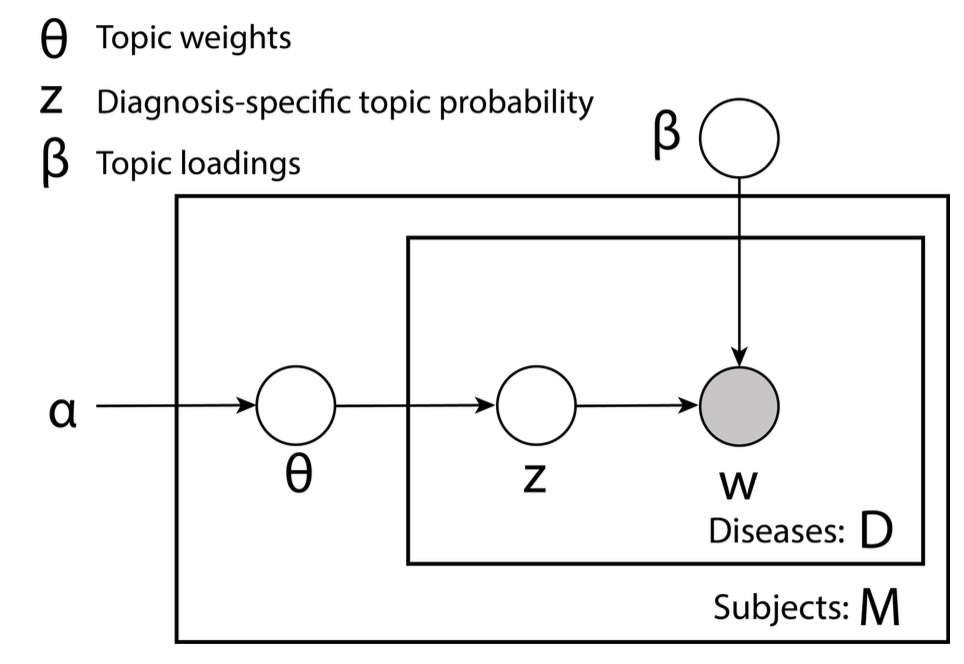

# Latent Factor Allocation (LFA) for Disease Topic Modeling

> This is a working draft and will be iteratively improved.

A Python package implementing state-of-the-art Bayesian inference algorithms for topic modeling in disease data. This package provides both **Mean Field Variational Inference (MFVI)** and **Partially Collapsed Gibbs Sampling (PCGS)** implementations for discovering latent disease topics and their associations.

All algorithms are implemented via NumPy and SciPy.

## What is Topic-Disease Modeling?

Topic modeling for disease data discovers latent patterns in patient diagnoses by identifying groups of diseases that co-occur. We can use topic models to identify disease clusters, comborbidity patterns, and their risk factors. In particular, by probabilistically assigning individuals to disease topics, we can perform a powerful 'Topic-GWAS' to identify genes underlying the progression of disease topics.

## What is LFA?

Latent Factor Allocation (LFA) is a a Bayesian hierarchical model built to infer latent risk profiles for common diseases. It is adapted from Latent Dirichlet Allocation, considering the case of Bernoulli-defined (binary) outcomes -- disease presence/absence. 

The model assumes there exist a few disease topics that underlie many common diseases. An individual’s risk for each disease is determined by the weights of
all topics.

<div align="center">
  
</div>

<div align="center">
  <em><small><strong>Figure 1:</strong> Plate notation of LFA generative model. M is the number of subjects, D is the number of diseases. All plates (circles) are variables in the generative process, where the plates with shade are the observed variable and plates without shade are unobserved variables to be inferred. θ is the topic weight for all individuals; z is diagnosis-specific topic probability; β is the topic loadings which are Bernoulli probabilities; α is the (non-informative) hyper parameter of the prior distribution of θ.</small></em>
</div>

For greater detail about the LFA model, see (reference)


## Available Algorithms in this Package

### Mean Field Variational Inference (MFVI)
A scalable approximate inference method that provides fast inference suitable for large datasets.

MFVI uses variational optimization to approximate the posterior distribution. The Evidence Lower Bound (ELBO) is maximized, and is tracked to monitor convergence.


### Partially Collapsed Gibbs Sampling (PCGS) 
A robust markov-chain monte carlo method that is suitable for small datasets.

PCGS samples from a conditional distribution to exactly approach the posterior distribution. The implementation runs multiple chains which are used to monitor convergence (via Gelman-Rubin statistic) and are averaged once samples are collected.

## Installation

### Prerequisites
- Python 3.8+
- NumPy, SciPy, Matplotlib, Seaborn, pandas

### From Source
```bash
git clone https://github.com/will-marella/LFA
cd LFA
pip install -e .
```

## Quick Start

### Basic MFVI Example
```python
import numpy as np
from src.experiment.simulation import simulate_topic_disease_data
from src.mfvi_sampler import run_mfvi_experiment

# Generate synthetic disease data
W, z_true, beta_true, theta_true = simulate_topic_disease_data(
    seed=42,
    M=1000,      # Number of patients
    D=20,        # Number of diseases  
    K=3,         # Number of topics
    topic_associated_prob=0.30,
    nontopic_associated_prob=0.01
)

# Run MFVI inference
result, metrics = run_mfvi_experiment(
    W=W,
    alpha=np.ones(4) / 10,  # K+1 for healthy topic
    num_topics=4,
    beta=beta_true,
    theta=theta_true,
    max_iterations=1000
)

print(f"Beta MAE: {metrics['beta_mae']:.4f}")
print(f"Converged in {metrics['num_iterations']} iterations")
```

### Basic PCGS Example
```python
from src.gibbs_sampler import run_cgs_experiment

# Run PCGS inference
result, metrics = run_cgs_experiment(
    W=W,
    alpha=np.ones(4) / 10,
    num_topics=4,
    num_chains=3,           # Multiple chains for convergence
    max_iterations=2000,
    beta=beta_true,
    theta=theta_true,
    r_hat_threshold=1.1     # Convergence threshold
)

print(f"R-hat overall: {metrics['r_hat_overall']:.4f}")
print(f"Converged: {metrics['converged']}")
```


## Data Format

### Input Data (W matrix)
- **Shape**: `(M, D)` where M = subjects, D = diseases
- **Type**: Binary matrix (0/1) indicating presence/absence of each disease
- **Example**:
  ```python
  # Patient 0 has diseases 1, 3, 5
  # Patient 1 has diseases 2, 7
  W[0, [1, 3, 5]] = 1
  W[1, [2, 7]] = 1
  ```

### Model Parameters
- **α (alpha)**: Dirichlet prior for topic proportions `(K,)`
- **β (beta)**: Topic-disease probability matrix `(K, D)`  
- **θ (theta)**: Subject-topic proportions `(M, K)`
- **z**: Topic assignments `(M, D)` (discrete) or `(M, D, K)` (probabilistic)

**Note**: This README is actively being developed. Feedback and contributions are welcome!
